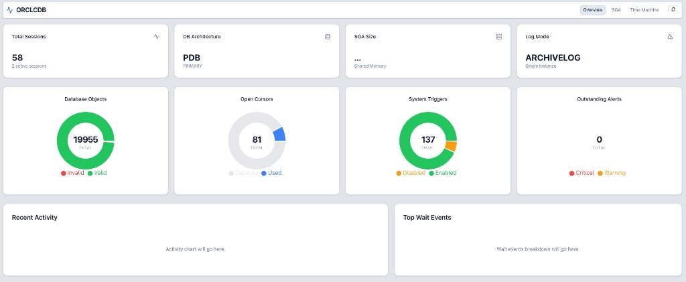
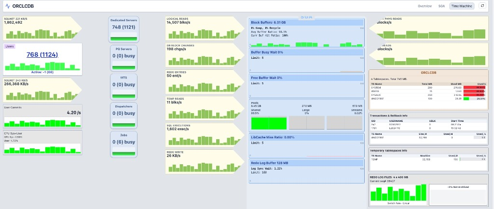
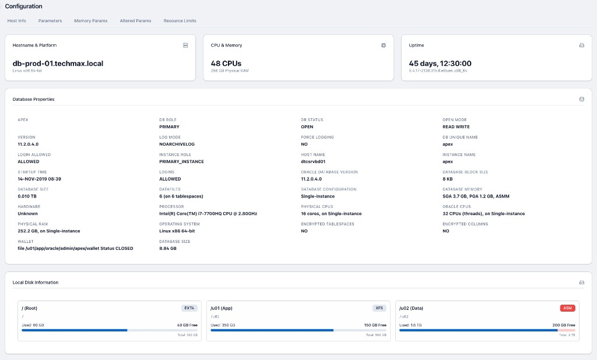
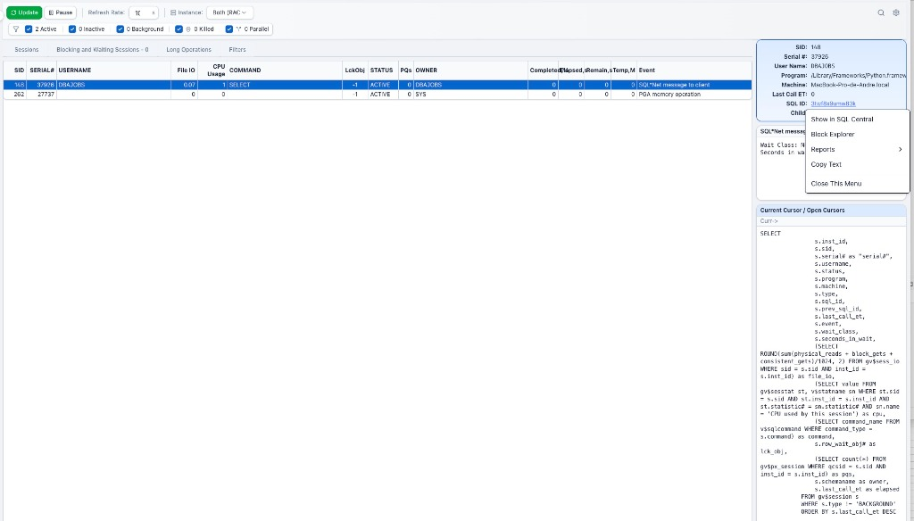
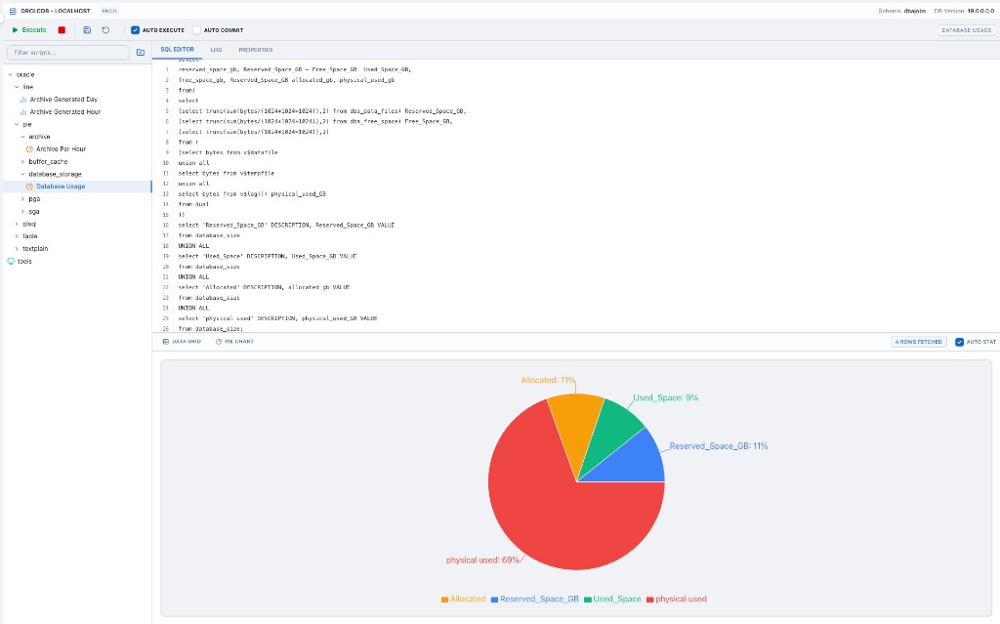
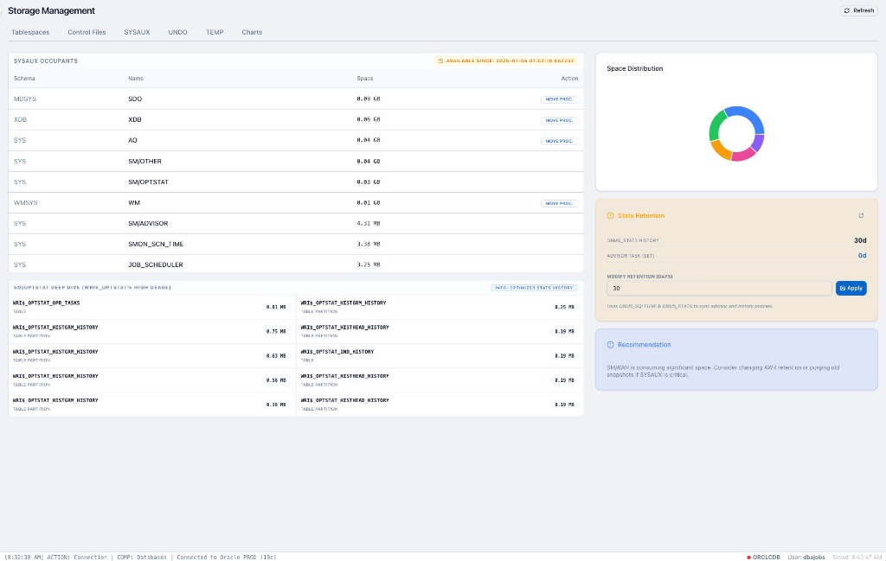
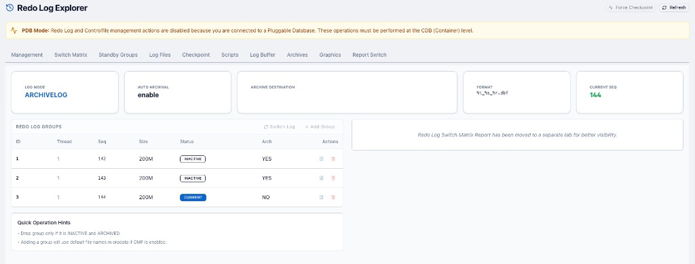
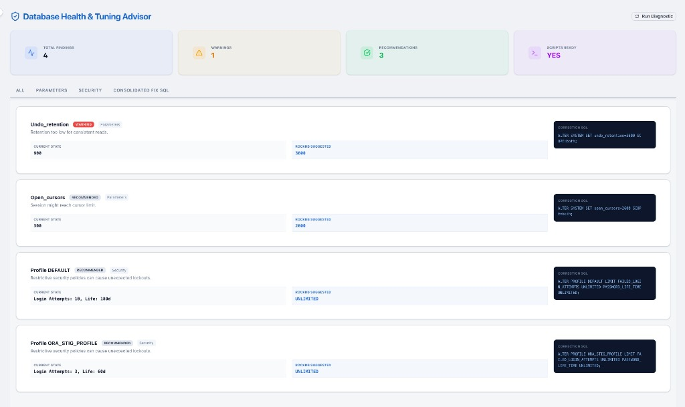
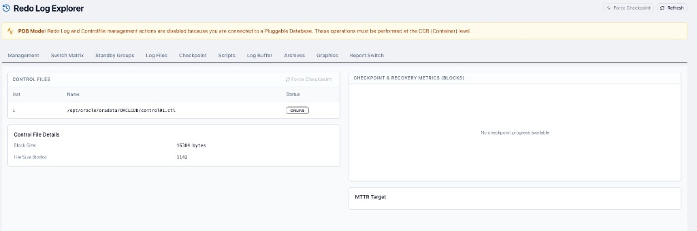

# 

# RockDB: Ultimate Oracle DBA Management Suite

**RockDB** is a state-of-the-art, high-density dashboard designed for professional Oracle Database Administrators. It provides a centralized console for real-time monitoring, proactive maintenance, and rapid troubleshooting of complex Oracle environments.

Built for **containerized deployment**, the suite eliminates manual configuration, providing a "single pane of glass" through a fast, modern React frontend and a robust FastAPI backend.

---

## 📺 Visual Tour

### 🚀 Core Performance & Host
| Main Dashboard | Performance Telemetry | Configuration & Host |
|:---:|:---:|:---:|
|  |  |  |

### 🔍 Deep Inspection & SQL
| Session Explorer | SQL Visualization | SYSAUX Deep Dive |
|:---:|:---:|:---:|
|  |  |  |

### 🔄 Protection & Optimization
| Redo Log Explorer | Healthcheck Advisor | Checkpoint Monitor |
|:---:|:---:|:---:|
|  |  |  |

---

## 🧭 Application Modules & Functionality

### 📊 Dashboard (Overview & SGA)
The command center of RockDB. It provides a real-time pulse of your database's health.
*   **Instance Intelligence**: Unified view of database status, version, uptime, and open mode.
*   **Object Tracking**: Monitor invalid objects, open cursors, and system triggers instantly.
*   **SGA/PGA High-Density View**: A specialized panel showing memory component distribution and performance hit ratios.
*   **Alert Center**: Aggregated view of outstanding alerts and critical health indicators.

### 🕵️ Session Explorer
Deep-dive into database activity with zero latency.
*   **Live Grid**: Monitor hundreds of sessions. Filters by SID, User, Machine, and Program.
*   **Visual Blocking Chain**: Identify "root cause" blockers through a hierarchical tree view. 
*   **Smart SQL Inspector**: Right-click any session to view its current SQL text, execution plan, and wait events.
*   **Admin Actions**: Instantly kill sessions or enable SQL Trace for precise debugging.

### 🔄 Redo Log Explorer
Navigate the redo lifecycle with ease.
*   **Group Management**: Visual tracking of redo log groups, threads, sequences, and statuses.
*   **Checkpoint Analytics**: Monitor control file health and recovery metrics in real-time.
*   **Lifecycle Control**: Perform one-click force checkpoints and log switches directly from the browser.

### 💾 Storage & SYSAUX Occupants
Visual capacity planning and physical layout control.
*   **Capacity Cards**: Real-time % used/free indicators for all tablespaces.
*   **SYSAUX Deep-Dive**: Identify exactly who is consuming space in your SYSAUX tablespace (MDSYS, XDB, SYS, etc.) with manual moving process capabilities.
*   **Physical Integrity**: Insights into Control Files, Checkpoint progress, and Force Checkpoint capabilities.

### ⚙️ Configuration & Host Info
A comprehensive X-ray of your database and server environment.
*   **Instance Registry**: Detailed properties including DB Unique Name, Instance Role, Processor info, and Encrypted status.
*   **Local Disk Topology**: Visual representation of host disk usage (Root, App, Data, ASM) with mount point details.
*   **Parameter Explorer**: Search and filter dynamic/static initialization parameters (`v$parameter`).

### ⚡ SQL Central & Scripts
The DBA's Swiss Army Knife for script execution and data visualization.
*   **Script Registry**: Organized folder-based storage (Health Checks, Maintenance, Security).
*   **Integrated Viz Engine**: Bind complex query results directly to interactive Pie Charts, Bar Charts, or Gauges within the SQL Central view.
*   **Multi-Engine Terminal**: Execute via SQLcl, RMAN, DGmgrl, or SQLLDR.

### 🩺 Healthcheck & Tuning Advisor
Proactive optimization and security hardening.
*   **Automated Diagnostics**: Run comprehensive checks on parameters, security policies, and performance bottlenecks.
*   **Correction SQL**: The advisor provides the exact `ALTER SYSTEM` or `ALTER PROFILE` commands to fix identified issues.

### ⏳ Time Machine
Historical workload replay powered by InfluxDB.
*   **Replay Mode**: Move through a 10-second granularity timeline to see past database states.
- **Root Cause Analysis**: Correlate past performance spikes with specific sessions or long-running jobs.

---

## 🚀 Technical Setup

### 1. Prerequisites
- **Node.js**: Modern JavaScript runtime.
- **Python 3.12+**: For the high-performance FastAPI backend.
- **Docker**: Required for the InfluxDB time-series engine.

### 2. Installation & Run
```bash
# 1. Install Dependencies
npm install
pip install -r backend/requirements.txt

# 2. Start Infrastructure
docker-compose up -d

# 3. Launch Application
npm run dev           # Frontend (Vite)
npm run python-server # Backend (FastAPI)
```

The application will be available at `http://localhost:5173`.

---
*Empowering DBAs with speed, clarity, and total control.*
