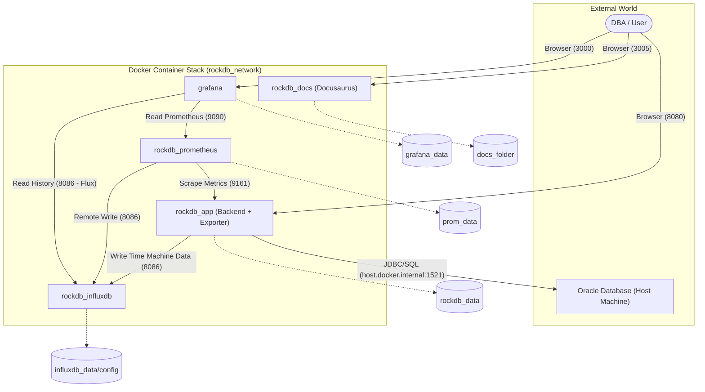

# 

# RockDB: Ultimate Oracle DBA Management Suite

**RockDB** is a state-of-the-art, high-density dashboard designed for professional Oracle Database Administrators. It provides a centralized console for real-time monitoring, proactive maintenance, and rapid troubleshooting of complex Oracle environments.

Built for **containerized deployment**, the suite eliminates manual configuration, providing a "single pane of glass" through a fast, modern React frontend and a robust FastAPI backend.

---

## 🏗️ System Architecture & Connectivity

RockDB operates as a fully containerized ecosystem, ensuring data persistence and seamless integration between observability tools.

### Communication Diagram



---

## 📺 Visual Tour

### 🚀 Core Performance & Host
| Main Dashboard | Performance Telemetry | Configuration & Host |
|:---:|:---:|:---:|
|  |  |  |

---

## 🧭 Application Modules

### ⏳ Time Machine & Metrics
*   **Historical Replay**: Revisit past database states with 10-second granularity, powered by **InfluxDB**.
*   **Oracle Exporter**: Integrated observability exporter feeding **Prometheus** and InfluxDB for long-term retention.
*   **Grafana Dashboards**: Premium pre-configured dashboards for deep performance analysis.

### 🕵️ Session & SQL Explorer
*   **Live Grid**: Real-time monitoring of hundreds of sessions with advanced filtering.
*   **Blocking Chains**: Visual tree representing root-cause blockers.
*   **SQL Inspector**: Instant execution plans, wait events, and SQL text.

### 💾 Storage & Capacity
*   **SYSAUX Deep-Dive**: Identify space consumption by Oracle components.
*   **Tablespace Management**: Visual capacity cards and physical integrity monitoring.

---

## 🚀 Getting Started

### 📦 Installation (Docker)

1. **Clone & Setup**:
   ```bash
   cd docker_rockdb
   cp .env.example .env # Configure your secrets
   ```

2. **Start the Stack**:
   ```bash
   docker-compose up -d --build
   ```

3. **Access Services**:
   - **RockDB App**: [http://localhost:8080](http://localhost:8080)
   - **Documentation**: [http://localhost:3005](http://localhost:3005)
   - **Grafana**: [http://localhost:3000](http://localhost:3000) (Admin / admin)
   - **InfluxDB**: [http://localhost:8086](http://localhost:8086)

### 📖 Documentation
For detailed guides on architecture, Oracle connectivity, and monitoring, visit our **English Documentation Portal** running on port `3005`.

---
*Empowering DBAs with speed, clarity, and total control.*
